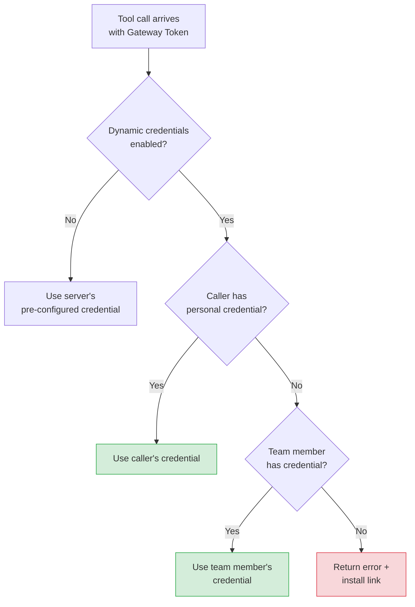

<!--
Check ../docs_writer_prompt.md before changing this file.
-->

MCP authentication in Archestra has two separate layers: the client-facing gateway layer and the upstream MCP server layer.

This separation is important because the MCP client usually should not know how every upstream system is authenticated. Cursor, Claude Desktop, Copilot CLI, Open WebUI, or a custom agent authenticates once to an MCP Gateway. Archestra then decides which installed MCP server connection and which upstream credential should be used for each tool call.

That means one gateway can expose tools backed by different credential models. A GitHub tool might use a user's OAuth token, a Jira tool might use an enterprise IdP token exchange, and an internal self-hosted tool might require no external credential at all. The client still talks to the same gateway.

The two layers are:

- **Gateway authentication**: how a client proves it can call `POST /v1/mcp/<gateway-id>`
- **Upstream MCP server authentication**: how Archestra authenticates to the MCP server or external system behind that gateway when a tool actually runs

Clients only send the gateway-facing token. Archestra resolves upstream MCP server authentication separately at execution time, using the caller identity, the gateway or Agent tool assignment, and the installed MCP server credential configuration.

Use this page to choose the gateway authentication method for your client, then choose how upstream credentials should be stored, resolved, exchanged, or forwarded when tools execute.

## Gateway Authentication

The MCP Gateway supports four client authentication paths. They do not all present the same token to `POST /v1/mcp/<gateway-id>`:

- **OAuth 2.1** and **ID-JAG** both end with an Archestra-issued OAuth access token being sent to the gateway
- **JWKS** sends an external IdP JWT directly to the gateway
- **Bearer token** sends a static platform-managed token directly to the gateway.

### OAuth 2.1

MCP-native clients such as Claude Desktop, Cursor, Copilot CLI, and Open WebUI authenticate automatically using the [MCP Authorization spec](https://modelcontextprotocol.io/specification/2025-11-25/basic/authorization). The gateway acts as both the resource server and the authorization server.

The gateway supports the following OAuth flows and client registration methods:

- **Authorization Code + PKCE**: The standard browser-based authorization flow. The user is redirected to a login and consent screen, and the client receives tokens upon approval.
- **DCR ([RFC 7591](https://datatracker.ietf.org/doc/html/rfc7591))**: Clients can register dynamically at runtime by posting their metadata to `POST /api/auth/oauth2/register`. The gateway returns a `client_id` for subsequent authorization requests.
- **CIMD**: Clients can use an HTTPS URL as their `client_id`. The gateway fetches the client's metadata document from that URL, eliminating the need for a separate registration step.

Endpoint discovery is automatic. The gateway exposes standard well-known endpoints so clients can find the authorization and token URLs without any hardcoded configuration:

- `/.well-known/oauth-protected-resource` ([RFC 9728](https://datatracker.ietf.org/doc/html/rfc9728))
- `/.well-known/oauth-authorization-server` ([RFC 8414](https://datatracker.ietf.org/doc/html/rfc8414))

#### Token lifetime

Archestra returns the lifetime of user OAuth access tokens through the standard `expires_in` field. The default lifetime is 1 year, which reduces unnecessary reconnects for MCP-native clients like desktop apps.

Admins can change this in **Settings > Organization > Auth**. The setting is organization-wide and applies to newly issued user OAuth access tokens, including MCP OAuth 2.1 and custom application authorization-code flows.

### Bearer Token

For direct API integrations, clients can authenticate using a static Bearer token with the header `Authorization: Bearer arch_<token>`. Tokens can be scoped to a specific user, team, or organization. You can create and manage tokens in **Settings > Tokens**.

Bearer tokens authenticate the client to Archestra. They are not enterprise assertions by themselves. If Archestra also needs to exchange the matched user's IdP token and use the result on the downstream MCP request, it must still have a usable IdP token for that user.

For per-user access to downstream systems like GitHub or Jira, bearer tokens should usually be **personal user tokens**. Team and organization tokens can authenticate to the gateway, but they do not identify a specific user strongly enough for Archestra to broker per-user downstream credentials on their own.

### Identity Assertion JWT Authorization Grant (ID-JAG)

This option implements the MCP [Enterprise-Managed Authorization](https://modelcontextprotocol.io/extensions/auth/enterprise-managed-authorization) extension using an [Identity Assertion JWT Authorization Grant (ID-JAG)](https://datatracker.ietf.org/doc/html/draft-ietf-oauth-identity-assertion-authz-grant). It is designed for organizations that already use a corporate IdP to sign users into MCP clients. The identity provider must be able to:

- authenticate the user to the MCP client
- perform [RFC 8693](https://datatracker.ietf.org/doc/html/rfc8693) token exchange to issue an ID-JAG
- sign that ID-JAG as a JWT that Archestra can validate through OIDC discovery or a JWKS endpoint

In this flow, the MCP client does not send the user's enterprise JWT directly to the gateway. Instead:

1. The user signs in to the MCP client with the enterprise IdP
2. The MCP client exchanges that identity assertion with the IdP for an ID-JAG
3. The MCP client sends the ID-JAG to Archestra's token endpoint using the JWT bearer grant
4. Archestra validates the ID-JAG against the configured IdP and returns an MCP access token
5. The MCP client calls the gateway with that MCP access token

Archestra supports the second leg of the flow generically at `POST /api/auth/oauth2/token` with:

- `grant_type=urn:ietf:params:oauth:grant-type:jwt-bearer`
- `assertion=<id-jag>`
- normal OAuth client authentication for the MCP client (`client_secret_basic`, `client_secret_post`, or `none` for public clients)

#### Requirements

- The MCP Gateway must be linked to an **OIDC** Identity Provider in Archestra
- The IdP-issued ID-JAG must be a JWT with header `typ=oauth-id-jag+jwt`
- The ID-JAG `aud` claim must match Archestra's OAuth issuer
- The ID-JAG `resource` claim must point to the target MCP Gateway URL (`/v1/mcp/<gateway-id>`)
- The ID-JAG `client_id` claim must match the authenticated MCP client
- The ID-JAG `scope` must include `mcp`
- The ID-JAG should include an `email` claim that matches an existing Archestra user account

Archestra binds the access token it issues to the specific MCP Gateway in the `resource` claim, so that token cannot be replayed against a different gateway.

See [How Enterprise-Managed Authorization Will Secure Remote MCP Servers in the Enterprise](https://archestra.ai/blog/enterprise-managed-authorization-mcp) for a longer walkthrough of the pattern.

### Identity Provider JWKS

Identity Providers (IdPs) configured in Archestra can also be used to authenticate external MCP clients. When an IdP is linked to an Archestra MCP Gateway, the gateway validates incoming JWT bearer tokens against the IdP's JWKS (JSON Web Key Set) endpoint and matches the caller to an Archestra user account. The same team-based access control that applies to Bearer tokens and OAuth also applies here — the JWT's email claim must correspond to an Archestra user who has permission to access the gateway.

After authentication, the gateway resolves credentials for the upstream MCP server. If the upstream server has its own credentials configured (e.g., a GitHub PAT or OAuth token), those are used. If no upstream credentials are configured, the gateway propagates the original JWT as an `Authorization: Bearer` header, enabling end-to-end identity propagation where the upstream server validates the same JWT against the IdP's JWKS. See [End-to-End JWKS](#end-to-end-jwks-without-gateway) below for how to build servers that consume propagated JWTs.

This credential resolution enables a powerful workflow: an admin installs upstream MCP servers (GitHub, Jira, etc.) with service credentials once, and any user who authenticates via their org's IdP can access those tools seamlessly — the gateway resolves the appropriate upstream token automatically. Both [static and per-user credentials](#upstream-mcp-server-authentication) work with JWKS authentication.

#### How It Works

1. Admin configures an OIDC Identity Provider in **Settings > [Identity Providers](/docs/platform-identity-providers)**
2. Admin creates an MCP Gateway and selects the Identity Provider to use for JWKS Auth
3. External MCP client obtains a JWT from the IdP (e.g., via client credentials flow or user login)
4. Client sends requests to the gateway with `Authorization: Bearer <jwt>`
5. Gateway discovers the JWKS URL from the IdP's OIDC discovery endpoint
6. Gateway validates the JWT signature, issuer, audience (IdP's client ID), and expiration
7. Gateway extracts the `email` claim from the JWT and matches it to an Archestra user account
8. Gateway resolves upstream credentials: if the server has its own credentials, those are used; otherwise the original JWT is propagated

#### Requirements

- The Identity Provider must be an **OIDC provider** (SAML providers do not support JWKS)
- The IdP must expose a standard OIDC discovery endpoint (`.well-known/openid-configuration`) with a `jwks_uri`
- The JWT `iss` claim must match the IdP's issuer URL
- The JWT `aud` claim must match the IdP's client ID (if configured)
- The JWT must contain an `email` claim that matches an existing Archestra user
- The user must have `profile:admin` permission or be a member of at least one team associated with the gateway they are trying to use

## Upstream MCP Server Authentication

MCP servers that connect to external services like GitHub, Atlassian, or ServiceNow need their own credentials. Archestra manages this with a two-token model:

- **Gateway Token** authenticates the client to the gateway using an Archestra OAuth access token, an ID-JAG-derived Archestra access token, an external IdP JWT via JWKS, or a static bearer token.
- **Upstream MCP Server Token** authenticates the gateway to the upstream MCP server. This token is resolved and injected by Archestra at runtime.

The client only ever sends the Gateway Token. Archestra resolves the Upstream MCP Server Token behind the scenes.

See [MCP Gateway - Authentication](/docs/platform-mcp-gateway#authentication) for the high-level gateway token and upstream token diagram.

Credentials are configured when you install a server from the [MCP Catalog](/docs/platform-private-registry). There are five types of upstream credentials:

- **Static secrets**: API keys or personal access tokens that are set once at install time and used for all requests.
- **OAuth tokens**: Obtained by running an OAuth flow against the upstream provider during installation. Archestra stores both the access token and refresh token.
- **OAuth client credentials**: Shared client credentials stored on the MCP connection and exchanged for a short-lived bearer token when a tool call runs.
- **Identity Provider Token Exchange**: Retrieved at tool-call time by exchanging the caller's IdP token for the downstream credential the MCP server needs.
- **Identity Provider JWT / JWKS**: Retrieved at tool-call time by forwarding the caller's IdP JWT to the upstream MCP server for direct JWKS-based validation.

Identity Provider Token Exchange can use a linked downstream IdP that is different from the gateway's primary login IdP, as long as the Archestra user has a usable token for that downstream IdP. See [Enterprise-Managed Auth — Linked downstream IdPs](/docs/platform-enterprise-managed-auth#linked-downstream-idps).

How credentials are delivered to the upstream server depends on the server type. For **passthrough** (remote) servers, Archestra sends the credential over HTTP. The primary auth header defaults to `Authorization`, but you can configure a different header name such as `x-api-key` when the upstream server expects the token outside the standard authorization header. Additional headers are available for tenant IDs and other non-auth upstream requirements, and non-sensitive static values are stored directly in the catalog item. For **hosted** (local) servers running in Kubernetes, the gateway connects via stdio transport within the cluster and no auth headers are needed.

Auth credentials are stored in the secrets backend, which uses the database by default. For enterprise deployments, you can configure an [external secrets manager](/docs/platform-secrets-management).

### Credential Resolution

Credential resolution decides which installed MCP server credential should be used for a tool call. A tool assignment can either pin a specific installed connection or ask Archestra to resolve a credential at execution time from the caller identity and available personal or team-scoped credentials.

#### Static Credentials

Static credentials are shared credentials configured on an installed MCP server connection. They can be API keys, PATs, service account tokens, OAuth tokens, OAuth client credentials, or other values required by the upstream server.

When you pin a tool to a specific installed MCP server connection instead of using dynamic resolution, Archestra validates the connection against the target Agent or MCP Gateway scope:

- **Team-installed connection**: can only be assigned to a **team-scoped** Agent or MCP Gateway that includes that same team
- **Personal connection**: can only be assigned to a resource the connection owner could access directly
- **Dynamic / resolve at call time**: skips static-owner checks because Archestra resolves credentials per caller at execution time

This means a team-shared connection is governed by the team it is shared with, not by the individual who originally installed it. Personal connections still follow the connection owner's access boundary.

#### Dynamic Credential Resolution

By default, each MCP server installation has a single credential that is shared by all callers.

When you enable "Resolve at call time" on a server, Archestra resolves the credential dynamically based on the caller's identity. This enables multi-tenant setups where each developer uses their own GitHub PAT or each team member uses their own Jira access token.

When dynamic credentials are enabled, Archestra resolves them in priority order:

1. The calling user's own personal credential (highest priority)
2. A credential owned by a team member on the same team
3. If no credential is found, an error is returned with an install link

#### Missing Credentials

When no credential can be resolved for a caller, the gateway returns an actionable error message that includes a direct link to install the MCP server with their own credentials:

> Authentication required for "GitHub MCP Server".
> No credentials found for your account (user: alice@example.com).
> Set up credentials: https://archestra.example.com/mcp/registry?install=abc-123

The user follows the link, installs the server with their credentials, and retries the tool call.

### OAuth 2.1

Use OAuth 2.1 when an upstream MCP server connects to a SaaS API where each user has their own account, such as GitHub or Salesforce.

Your server or its OAuth provider needs to expose two things:

- A `/.well-known/oauth-protected-resource` endpoint that points to the authorization server
- A 401 response with a `WWW-Authenticate` header when tokens are missing or expired

Archestra handles endpoint discovery, client registration, Authorization Code + PKCE, token storage, and token injection. Your server receives an `Authorization: Bearer <access_token>` header with each request from the gateway.

If the MCP server URL is different from the OAuth issuer or metadata host, configure explicit OAuth overrides in the MCP catalog item. Archestra can use a separate authorization server URL, a direct well-known metadata URL, a direct resource metadata URL, or direct authorization and token endpoints instead of deriving everything from the MCP server URL.

Direct authorization and token endpoints are useful for legacy or self-hosted OAuth providers that expose fixed OAuth URLs but do not publish `/.well-known` metadata.

#### OAuth Client Credentials

Use OAuth client credentials when a remote MCP server expects Archestra to obtain a short-lived bearer token from an OAuth 2.0 token endpoint using `grant_type=client_credentials`.

Archestra stores the shared `client_id`, `client_secret`, and optional `audience` on the installed MCP connection. At runtime it exchanges those values for an access token, injects that token as `Authorization: Bearer <token>`, and reuses it until the configured refresh window is reached.

This is a shared connection pattern, not a per-user identity pattern:

- install one connection per team or shared scope
- assign tools to that installed connection directly
- do not use `Resolve at call time` unless you want Archestra to choose among multiple installed shared credentials

#### Auto-Refresh

For upstream servers that use OAuth, Archestra handles the token lifecycle automatically. When the upstream server returns a 401, Archestra uses the stored refresh token to obtain a new access token and retries the request without any user intervention. Refresh failures are tracked per server and are visible in the MCP server status page.

### Enterprise Identity Credential Resolution

Archestra can also resolve a token at tool-call time by asking the configured identity provider or broker for one. Instead of storing the downstream token in Archestra ahead of time, Archestra exchanges the signed-in user's IdP token and injects the returned token into the MCP request.

These modes are configured across three places:

- **Identity Provider**: how Archestra authenticates to the IdP for credential exchange
- **MCP catalog item**: whether Archestra should exchange a downstream credential or pass through the caller's IdP JWT, plus how the resulting credential should be injected
- **Tool assignment**: choose `Resolve at call time`

This model works best for remote MCP servers and local MCP servers using HTTP transport. Local stdio servers do not support per-request token exchange and injection.

For MCP Gateways, this token exchange uses the caller identity that was established at the gateway:

- **JWKS**: Archestra can use the incoming external IdP JWT directly
- **ID-JAG**: Archestra uses the enterprise assertion path associated with the gateway's Identity Provider
- **OAuth 2.1**: Archestra resolves the authenticated Archestra user and then uses that user's linked IdP session, if one exists
- **Bearer token**: Archestra can only exchange a downstream token if the bearer token maps to a specific user with a linked IdP session

For external MCP clients such as Cursor, **ID-JAG** and **JWKS** are usually the clearest options when you want per-user access to upstream systems like GitHub or Jira.

#### Identity Provider Token Exchange

When Archestra is configured to exchange the caller's IdP token at tool-call time, it uses one of three exchange strategies.

- **RFC 8693 token exchange**: Archestra exchanges the user's token at the IdP token endpoint and uses the returned bearer token on the downstream MCP request.
- **Okta managed credential exchange**: Archestra exchanges the user's token for an Okta-managed credential such as a secret or bearer token, then injects the configured value into the downstream MCP request.
- **Microsoft Entra on-behalf-of (OBO)**: Archestra exchanges the signed-in user's Entra access token for the downstream API token the MCP server needs.

Archestra uses the exchange mode configured on the Identity Provider to decide how to exchange the user's IdP token before calling the downstream MCP server.

##### How To Enable This

Configure all three of the following:

- **Identity Provider**: In **Settings > Identity Providers**, open the OIDC provider and fill in the optional **Enterprise-Managed Credentials** section so Archestra knows how to call the IdP or broker token endpoint.
- **MCP catalog item**: In the server's multitenant authorization settings, choose either **Identity Provider Token Exchange** to exchange the caller's IdP token for a downstream token, or **Identity Provider JWT / JWKS** to forward the caller's IdP JWT directly.
- **Tool assignment**: Assign the tool with **Resolve at call time** so Archestra resolves credentials per caller when the tool runs.

See [Enterprise-Managed Auth](/docs/platform-enterprise-managed-auth) for related setup details.

This works with any gateway auth method that lets Archestra resolve a specific user and a usable IdP token for that user. In practice, **JWKS** and **ID-JAG** are the clearest options, **OAuth 2.1** also works when the authenticated Archestra user has a linked session with the same IdP, and personal user bearer tokens can work when they map to a specific user with a linked IdP session. Team and organization bearer tokens do not carry enough user identity for per-user downstream token exchange.

##### Token Exchange Configuration

When you choose **Identity Provider Token Exchange** on the MCP catalog item, the following fields control what Archestra asks the IdP or broker for and how the returned value is used:

- **Requested Credential**: The type of value Archestra should request from the IdP or broker. Common options are a bearer token, secret, ID-JAG, service account, or opaque JSON payload.
- **Injection Mode**: How Archestra should send the returned value to the upstream MCP server. The common modes are `Authorization: Bearer`, raw `Authorization`, or a custom header.
- **Managed Resource Identifier**: The audience, resource ID, or similar target identifier that tells the IdP or broker which downstream system token to mint.
- **External Provider Alias**: Optional broker-specific selector used when one identity provider can mint tokens for multiple downstream providers. For example, a Keycloak broker might use an alias such as `github`.
- **Response Field Path**: Optional field name to extract when the IdP or broker returns a structured payload instead of a raw token or secret.
- **Header Name**: Only used when the injection mode is a custom header. This sets the exact upstream header name, such as `X-Provider-Token`.

##### When To Use It

With **Identity Provider Token Exchange**, Archestra resolves the caller's enterprise assertion and exchanges it for the downstream credential the MCP server needs.

Use this mode when the upstream system or credential broker expects Archestra to exchange the caller's enterprise identity for a different downstream token.

This is different from using ID-JAG to authenticate to the MCP Gateway:

- **ID-JAG at the MCP Gateway** exchanges an enterprise assertion for an Archestra-issued MCP access token
- **Identity Provider Token Exchange** obtains the credential used for the downstream MCP tool call itself

#### Identity Provider JWT / JWKS

With **Identity Provider JWT / JWKS**, Archestra resolves the caller's enterprise assertion and forwards that JWT to the upstream MCP server as `Authorization: Bearer <jwt>`, so the upstream server can validate it against the IdP's JWKS directly.

Use this mode when the upstream MCP server already understands the enterprise IdP's JWTs and should make its own authorization decisions from those claims.

This is different from using JWKS to authenticate to the MCP Gateway:

- **JWKS at the MCP Gateway** authenticates the caller to Archestra
- **Identity Provider JWT / JWKS** provides the credential used for the downstream MCP tool call itself

## End-to-End JWKS

When an MCP Gateway is configured with [Identity Provider JWKS](#identity-provider-jwks), the gateway propagates the caller's JWT to upstream MCP servers. Your MCP server receives the JWT as an `Authorization: Bearer` header and can validate it directly against the IdP's JWKS endpoint — statelessly, without any Archestra-specific integration.

This pattern is useful when your MCP server needs to enforce its own access control based on IdP claims (roles, groups, etc.), or when the server is also deployed outside of Archestra and needs to authenticate users independently.

See [Building Enterprise-Ready MCP Servers with JWKS and Identity Providers](https://archestra.ai/blog/enterprise-mcp-servers-jwks) for a full walkthrough with code examples.

## ID-JAG vs JWKS

ID-JAG and JWKS both rely on enterprise-issued JWTs, but they solve different problems.

In the product UI, these choices appear in two different places:

- **MCP Gateway dialog**: choose the Identity Provider the gateway trusts for enterprise client authentication
- **MCP catalog item > Multitenant Authorization**: choose whether the upstream MCP server should receive an exchanged credential (**Identity Provider Token Exchange**) or the caller's original IdP JWT (**Identity Provider JWT / JWKS**)

**ID-JAG** is a token exchange pattern. The MCP client first obtains an enterprise-issued identity assertion, exchanges it for an ID-JAG, and then exchanges that ID-JAG with Archestra for an MCP access token. Archestra validates the ID-JAG and issues a new gateway token scoped to the target MCP Gateway.

**JWKS authentication** is direct JWT validation. The MCP client sends the enterprise JWT directly to Archestra, and Archestra validates that JWT against the IdP's JWKS endpoint on each request.

Use **ID-JAG** when:

- your MCP client uses the ID-JAG token exchange flow
- you want Archestra to mint its own MCP access token for the gateway
- you want the resulting gateway token bound to a specific MCP resource

Use **JWKS** when:

- your MCP client already has a usable bearer JWT from the enterprise IdP
- you want direct JWT validation without a token exchange step
- you want the original enterprise JWT propagated to upstream MCP servers

In short: **ID-JAG** exchanges an enterprise assertion for an Archestra-issued MCP token, while **JWKS** validates and forwards the enterprise JWT directly.
