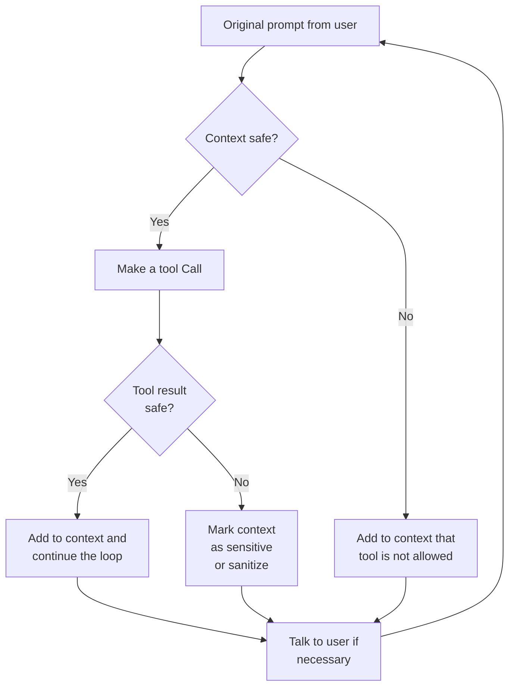

<!--
Check ../docs_writer_prompt.md before changing this file.

This document is human-built, shouldn't be updated with AI. Don't change anything here.

Exception:
- Screenshot
-->

AI tool guardrails address the "lethal trifecta" by enforcing deterministic rules around tool use and tool outputs. Agents can still read sensitive internal data and process untrusted content, but Archestra can dynamically block risky follow-up actions when the context is no longer safe.

This gives you a middle ground between two extremes:

- A fully permissive agent that can read anything and send anything anywhere
- A permanently read-only agent that can never take external action

With AI tool guardrails, the same agent can operate normally in safe contexts and become more restricted only when context or tool output requires it.



## How It Works

### Tool Discovery

Archestra discovers tools in two main ways:

1. **LLM Proxy tool discovery**. When requests flow through the [LLM Proxy](/docs/platform-llm-proxy), Archestra records the tool definitions included in those requests.
2. **Archestra-orchestrated MCP tool discovery**. When tools belong to MCP servers managed by the [Archestra MCP Orchestrator](/docs/platform-orchestrator), Archestra already knows those tool definitions and surfaces them in the same guardrails view.

This gives you one control plane for tools discovered from live agent traffic and tools hosted by MCP infrastructure that Archestra orchestrates directly.

### Tool Result Policies

Tool result policies control how tool output is treated after a tool runs.

Available actions:

- **Safe**: The result is considered safe and can continue through the agent loop normally.
- **Sensitive**: The result is treated as sensitive or risky context for later decisions.
- **Dual LLM**: The result is routed through the [Dual LLM Agent](/docs/platform-dual-llm) before it is returned to the main agent.
- **Blocked**: The result is blocked entirely.

Use tool result policies when the tool itself may be safe to call, but the returned data could still be sensitive, adversarial, or prompt-injectable.

For example, a `read_email` tool may be safe to call, but the returned messages may still contain untrusted external content:

```json
{
  "emails": [
    { "from": "eng@mycompany.com", "subject": "Build green" },
    { "from": "vendor@example.com", "subject": "Invoice attached" }
  ]
}
```

You can define one or more tool result policies that inspect the response and decide how to classify it:

- If every `emails[*].from` value ends with `@mycompany.com`, mark the result as **Safe**
- If any `emails[*].from` value comes from outside your domain, mark the result as **Sensitive**

That lets the agent continue normally when it is only reading internal mail, while automatically tightening later tool use after reading email from outside your company.

### Tool Call Policies

Tool call policies control whether a tool may run in the current context.

Available actions:

- **Allow always**: The tool can run even when the current context is marked sensitive or untrusted.
- **Allow in safe context**: The tool can run only while the current context is still safe.
- **Require approval**: The tool requires explicit user approval in chat. In autonomous execution contexts, the call is blocked.
- **Block always**: The tool is never allowed to run automatically.

Use tool call policies to separate safe internal read paths from tools that could exfiltrate data or cause side effects.

For example, a `send_email` tool may only be acceptable for internal recipients:

```json
{
  "to": ["alice@mycompany.com", "bob@mycompany.com"],
  "subject": "Deployment update",
  "body": "Build is complete."
}
```

You can define one or more tool call policies that inspect the arguments before the tool runs:

- If every `to[*]` value ends with `@mycompany.com`, use **Allow always**
- If any `to[*]` value points outside your domain, use **Require approval** or **Block always**

This makes the policy decision depend on the actual attempted action, not just on the name of the tool.

### Context-Aware Enforcement

Archestra evaluates tool calls against the current context, not just against a static allowlist:

- If the context is safe, more tools can run.
- If the context contains sensitive or untrusted data, only tools explicitly allowed in that state can run.
- If a tool result policy marks returned data as untrusted, later tool call policy evaluation becomes stricter.

This lets the same agent behave normally in safe contexts and become more restricted only after the conversation or tool output crosses a trust boundary.

Policies can also be scoped to specific agents. For example, you might allow an internal support agent to use `send_email` for `@mycompany.com` recipients while keeping the same tool blocked for a broader research agent.

Subagent "delegation" does not reset that trust state. If a parent agent delegates to a subagent after the conversation has already become sensitive, the subagent inherits that unsafe context and the same tool call restrictions continue to apply.

### Load Tools When Needed

When an agent or MCP Gateway uses [Load tools when needed](/docs/platform-agents#load-tools-when-needed), the initial MCP `tools/list` only includes `search_tools` and `run_tool`.

Tool call policies are still evaluated against the tool that actually runs. If `run_tool` is asked to execute `send_email`, Archestra evaluates the `send_email` policies with the submitted `tool_args`, current trust state, and policy context. Input conditions, team conditions, untrusted-context rules, and approval-required rules work the same way as a direct `send_email` tool call.

## Policy Configuration Agent

Archestra includes a built-in [Tool Policy Configuration Agent](/docs/platform-built-in-agents-policy-config) that analyzes tool metadata and proposes default tool call policies and tool result policies automatically.

Use it when you want a fast starting point for new tools instead of configuring every default policy by hand.

## Deterministic Guardrails vs LLM Guardrails

Many platforms use probabilistic LLM guardrails that ask a model to decide whether content or actions are allowed. Those can be useful for moderation and soft classification, but they are not ideal as the final control plane for tool execution.

Archestra's AI tool guardrails are different:

- Deterministic: the final allow/block decision comes from stored policies, not a fresh model judgment at execution time.
- Context-aware: the same tool can be allowed or blocked depending on whether the conversation has become sensitive.
- Auditable: you can inspect the exact tool call policies and tool result policies applied to each tool and the exact tool call that was blocked.
- Composable: tool result policies, tool call policies, and Dual LLM can be combined into a single security workflow.

Use probabilistic LLM guardrails when you want fuzzy classification or moderation. Use deterministic AI tool guardrails when you need predictable enforcement against data exfiltration and unsafe tool chaining.
