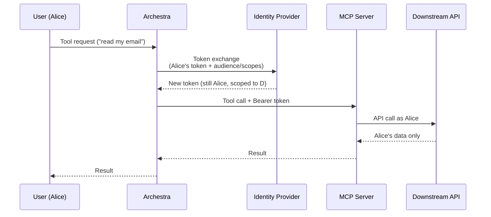

<!--
Check ../docs_writer_prompt.md before changing this file.

Provider-agnostic concept page covering downstream-credential strategies:
- Microsoft Entra OBO
- Okta-managed token exchange
- RFC 8693 generic token exchange
- ID-JAG / Cross-App Access (XAA)

Includes a runtime flow diagram, decision table, the three-place wiring recipe,
field reference, and limitations. Per-provider walkthroughs (Entra, Okta) live
on their own pages.
-->

SSO gets the user signed in. **Enterprise-Managed Auth** is what happens after — when an agent or MCP server needs to call a downstream API and the call should carry the *user's* identity, not a shared service-account credential.

## Why this matters

When Alice asks an agent to *"summarize my unread emails"*, the agent has to call Microsoft Graph somewhere. The naive way is to give the MCP server a single shared secret. Every user's request hits Graph as the same robot account — audit logs show "the Archestra service account" read the email, not Alice. If Alice doesn't have access to a particular mailbox, the tool reads it anyway because it's running as the robot.

Enterprise-Managed Auth solves this. When Alice signs in, Archestra holds her identity-provider token. The moment a tool needs to call a downstream API, Archestra hands that token back to the IdP and asks for a *new* one — same user, scoped narrowly to the API the tool needs. The downstream call carries Alice's real identity. If she's not allowed, it fails. If she is, the audit trail shows it was her.

## Strategies at a glance

Archestra supports four flavors of downstream-credential exchange. Pick the one your identity provider speaks.

| Strategy | What it does | Best for | Setup guide |
| --- | --- | --- | --- |
| **Microsoft Entra OBO** | Exchanges the user's Entra access token for a Graph (or other Entra-protected API) token | Microsoft 365 environments — Outlook, Teams, SharePoint, OneDrive, your own Entra-protected APIs | [Microsoft Entra ID SSO + OBO](/docs/platform-entra-obo-setup) |
| **Okta-managed token exchange** | Exchanges the user's Okta ID token for a downstream API token, signing the request with `private_key_jwt` | Okta tenants and Okta-fronted APIs | [Okta SSO + Token Exchange](/docs/platform-okta-setup) |
| **RFC 8693 token exchange** | Generic OAuth 2.0 token exchange ([RFC 8693](https://datatracker.ietf.org/doc/html/rfc8693)) | Keycloak, Auth0 actions, custom OIDC providers that expose a token-exchange endpoint | This page (default for any non-Okta, non-Entra OIDC issuer) |
| **ID-JAG / Cross-App Access (XAA)** | Identity Assertion Authorization Grant — your IdP issues a signed assertion that a *third-party* app can swap for that app's token | Cross-app integrations where an external SaaS accepts ID-JAG (for example [motd.xaa.rocks](https://motd.xaa.rocks)) | This page |

Archestra **infers the strategy automatically** from the OIDC issuer URL: Okta hostnames → Okta-managed, Microsoft hostnames → Entra OBO, anything with `/realms/` in the path → RFC 8693, everything else → RFC 8693. You can override the inference in the Enterprise-Managed Credentials form.

## Wiring it up

To use Enterprise-Managed Auth on a given MCP server, configure three places:

1. **Identity Provider** — In **Settings > Identity Providers**, open the OIDC provider and complete the **Enterprise-Managed Credentials** section. The main fields are **Exchange Client ID**, **Exchange Client Secret**, **Exchange Token Endpoint**, **Exchange Client Authentication**, and **User Token To Exchange**.
2. **MCP catalog item** — In the server's **Multitenant Authorization** settings, choose **Identity Provider Token Exchange**. Set the **Requested Credential**, **Injection Mode**, and the **Managed Resource Identifier** for the downstream API.
3. **Tool assignment** — Assign the tool with **Resolve at call time** so Archestra resolves the downstream credential for the caller every time the tool runs.

Per-provider pages walk through each of these steps with concrete field values for that provider.

## Linked downstream IdPs

The IdP used for Archestra sign-in does not have to be the same IdP used for a downstream MCP tool. For example, users can sign into Archestra with Okta while one MCP tool calls an Entra-protected internal API.

Configure the downstream IdP in **Settings > Identity Providers**, then disable **Use for Single Sign-On**. The provider remains usable for account linking and Enterprise-Managed Auth, but it will not appear as a primary SSO option on the login screen, and its role mapping and team sync never run — so connecting it for a downstream token cannot change the user's Archestra role or team memberships.

For this pattern to work, each user needs a downstream IdP session at least once so Archestra has a usable token for that IdP. Users do not need to find or configure this manually: if a tool call needs that token and it is missing or expired, Archestra returns an authentication-required tool result with a direct SSO link for the downstream IdP. After the user completes that SSO flow, Archestra links the downstream IdP account to the Archestra user who started the tool call, restores the original browser session, and sends the user back to the same chat so they can retry.

The same linked-IdP check also runs during MCP installation when Archestra needs an exchanged user token to discover tools from a protected MCP server. The installer is redirected to the configured downstream IdP first, then returned to continue the install.

Once a catalog item has enterprise-managed credential settings, those settings are authoritative for every tool call against that server: tool assignments created before the settings were added (or assigned through paths that did not record an explicit credential mode) are still resolved through the per-user credential exchange at call time, rather than falling back to static install credentials.

The downstream IdP email does not have to match the primary SSO email. The link is scoped to a short-lived request created from the active Archestra session, not to email matching. Normal SSO sign-in still follows the deployment's account-linking rules.

The linked IdP should request the scopes needed to identify and refresh the linked IdP session. For Entra OBO, it must also request a delegated scope exposed by the Archestra/middle-tier app registration so the linked access token is issued to Archestra and can be used as the OBO assertion.

- `openid`, `profile`, and `email` so Archestra can complete OIDC sign-in and link the IdP account to the current user
- `offline_access` when the IdP supports refresh tokens, so Archestra can refresh the linked token instead of asking the user to reconnect on every expiry
- For Entra OBO, the Archestra app's exposed delegated scope, for example `api://<archestra-app-client-id>/user_impersonation` or `api://<archestra-app-client-id>/access_as_user`

If these scopes are missing, the browser login can appear to succeed but Archestra may not persist the linked IdP account.

If the Entra OBO delegated scope is missing, Entra issues the linked access token for Microsoft Graph, and the OBO exchange rejects it with `AADSTS50013` (assertion signature validation failed) — Graph tokens use a proprietary signature that token endpoints cannot verify. Archestra detects Graph-audience tokens during the install preflight and treats the account as not connected, so the installer is sent back through the link flow. After adding the delegated scope, affected users must reconnect the downstream IdP once (the install flow prompts automatically, or visit `/auth/sso/<provider-id>?mode=linked-idp&redirectTo=/mcp/registry` directly); token refreshes keep the original Graph audience, so a refresh alone never fixes it.

Downstream API access is configured on the MCP catalog item, not by adding every downstream API scope to the linked IdP login. For Entra OBO, set the MCP server's **Managed Resource Identifier** to the downstream resource, such as `https://graph.microsoft.com` or `api://<downstream-app-client-id>`. Archestra requests `<resource>/.default` during the OBO exchange, and Entra issues only the delegated permissions that have been granted and consented for that resource, such as `Mail.Read` or a downstream API's own `user_impersonation` scope.

For 10 custom MCP servers that each call a different Entra-protected API, configure the same hidden Entra IdP once with the Archestra app's own exposed scope, then set each MCP catalog item to its own downstream resource identifier. Do not add all 10 downstream APIs' delegated scopes to the IdP login scopes unless you intentionally want the user to consent to all of them during the IdP linking flow.

When the tool runs, Archestra uses the tool's configured IdP token, exchanges it for the downstream API token, and injects the resulting credential into the MCP request.

Example:

1. Okta is enabled as the visible SSO provider for Archestra login
2. Entra ID is configured as a hidden OIDC provider with Entra OBO settings
3. The MCP catalog item selects **Identity Provider Token Exchange** and points to the Entra provider
4. The user clicks the tool's Entra SSO link the first time Archestra needs an Entra token
5. The user calls the MCP Gateway through their normal Okta-backed Archestra identity
6. Archestra exchanges the linked Entra user token for the downstream API token

## ID-JAG and Cross-App Access

ID-JAG is a draft IETF spec (and the foundation of [OpenID Cross-App Access](https://openid.net/wg/cross-app-access/)) that extends the OAuth 2.0 token-exchange flow to multi-app scenarios. Instead of asking the IdP for a token Archestra itself will use, Archestra asks the IdP for a *signed assertion* that a third-party app can verify and swap for its own token.

The practical use case: your enterprise IdP (say Okta) is the source of truth for who Alice is, but Alice also uses a third-party SaaS that doesn't trust your IdP directly. With ID-JAG configured, that third-party can accept the assertion, validate the IdP's signature, and issue Alice a token without Alice ever logging in to it again.

A live demo of this is [motd.xaa.rocks](https://motd.xaa.rocks) — a "Resource" application that exchanges valid ID-JAGs for access tokens against its `/token` endpoint, then serves a message of the day at `/motd` (and exposes an MCP server at `/mcp`).

To use ID-JAG with Archestra:

1. Configure your IdP to issue ID-JAGs with the audience equal to the third-party app
2. In the MCP catalog item, set **Requested Credential** to **ID-JAG** and **Managed Resource Identifier** to the resource server URL or audience
3. If the MCP server is an OAuth protected resource, set the protected-resource token endpoint audience and resource client credentials
4. Archestra exchanges the user's IdP token for an ID-JAG, swaps that ID-JAG at the protected resource's authorization server, and sends the resulting access token to the MCP server

## Field reference

The Enterprise-Managed Credentials form on each OIDC provider has these fields:

| Field | What it is |
| --- | --- |
| **Exchange Client ID** | The OAuth client Archestra uses when calling the IdP's token-exchange endpoint. Defaults to the main OIDC client ID. |
| **Exchange Client Secret** | The matching secret. Only used when client authentication is `client_secret_post` or `client_secret_basic`. |
| **Exchange Token Endpoint** | The IdP's token endpoint. For Entra: `https://login.microsoftonline.com/<TENANT_ID>/oauth2/v2.0/token`. For Okta: `https://<your-org>.okta.com/oauth2/v1/token`. |
| **Exchange Client Authentication** | How Archestra authenticates to the token endpoint. Options: `Private key JWT` (Okta default), `Client secret POST` (Entra OBO and RFC 8693 default), `Client secret Basic`. |
| **Signing Key ID** | The `kid` of the public key registered with the IdP. Only used with `private_key_jwt`. |
| **Client Assertion Audience** | Optional override for the `aud` claim of the client assertion. Defaults to the exchange token endpoint. |
| **User Token To Exchange** | Which token Archestra should hand back to the IdP for exchange. `Access token` (Entra default), `ID token` (Okta default), or generic `JWT`. |

For OAuth protected resources that accept ID-JAG, the MCP catalog item can also override the resource app's client ID and secret. Use these overrides when the requesting app registered with the IdP is different from the client that authenticates to the resource authorization server.

### Strategy defaults

When the strategy is inferred from the issuer URL, Archestra pre-fills sensible defaults:

| Strategy | Client authentication | User token type |
| --- | --- | --- |
| **Microsoft Entra OBO** | Client secret POST | Access token |
| **Okta-managed** | Private key JWT | ID token |
| **RFC 8693** | Client secret POST | Access token |

You can override any of these in the form.

## Limitations

- **Per-user identity required.** Token exchange only works when Archestra knows which user is calling. Gateway auth methods that carry per-user identity work: **Identity Provider JWT / JWKS**, **OAuth 2.1**, **ID-JAG**, and personal user bearer tokens. Team and organization bearer tokens do not — they don't resolve to a single user.
- **HTTP transport only for local MCP servers.** Per-request token exchange and injection require the **streamable-http** transport. Local **stdio** MCP servers cannot do this — Archestra has no way to inject a fresh per-call header into a stdio process.
- **The user must have a linked IdP session.** OAuth 2.1 gateway auth works when the authenticated Archestra user has a usable token for the IdP configured on the tool. This can be the same provider used for Archestra login, or a linked downstream provider used only for downstream MCP auth. JWKS-based gateway auth can use the incoming JWT directly when the gateway IdP and tool IdP match.
- **SAML providers are not supported.** Token exchange is OIDC-only. SAML doesn't have an equivalent flow.

## See also

- [SSO](/docs/platform-sso) — sign users in via OIDC or SAML (the prerequisite for everything on this page)
- [MCP Authentication — Upstream Identity Provider Token Exchange](/docs/mcp-authentication#upstream-identity-provider-token-exchange) — implementation details and gateway-side flow
- [Microsoft Entra ID SSO + OBO](/docs/platform-entra-obo-setup) — Entra walkthrough
- [Okta SSO + Token Exchange](/docs/platform-okta-setup) — Okta walkthrough
