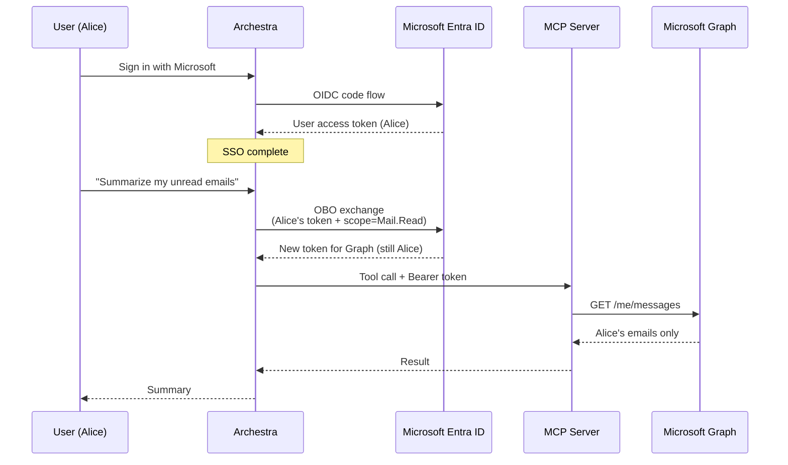

<!--
Check ../docs_writer_prompt.md before changing this file.

Six top-level sections, in order:
1. Register Entra App for SSO          (minimum app reg for sign-in)
2. Configure SSO in Archestra          (paste values into IdP form)
3. Roles & Teams Sync                  (one Entra example, link to parent page)
4. Additional Entra App Settings for OBO  (Expose API, self-authorize, scopes)
5. Configure OBO in Archestra          (Enterprise-Managed Credentials)
6. Connect MCP Server                  (Multitenant Authorization, Resolve at call time)

Keep it short. No "Best Practices" or "Future Considerations". Replace the
[screenshot: ...] markers with real screenshots from the running platform per
docs_writer_prompt.md.
-->

This guide configures Microsoft Entra ID with Archestra end-to-end. After you finish, your users will sign in once with their work Microsoft account and the agents and MCP servers they use will act on their own behalf — reading their mailbox, calendar, files, or any Entra-protected API as them, not as a shared service account.

**On-Behalf-Of (OBO)** is the OAuth flow defined by Microsoft that makes the second half possible: it lets Archestra exchange a user's access token for a new token scoped to a downstream API while preserving the user's identity. ([Microsoft docs](https://learn.microsoft.com/en-us/entra/identity-platform/v2-oauth2-on-behalf-of-flow))

The first three sections get sign-in working. If that is all you need today, you can stop after Section 3 and come back to OBO later. Sections 4 through 6 layer the OBO flow on top of the same app you just registered.

# Configuring SSO

## 1. Register Entra App for SSO

### Create the app registration

1. **Microsoft Entra ID** > **App registrations** > **+ New registration**
2. Fill in:
   - **Name:** `Archestra`
   - **Supported account types:** _Accounts in this organizational directory only — Single tenant_
   - **Redirect URI:** _Web_ → `https://your-archestra-domain.com/api/auth/sso/callback/EntraID`

   For local development use `http://localhost:3000/api/auth/sso/callback/EntraID`. The `EntraID` segment is case-sensitive.
3. Click **Register**
4. On the **Overview** page, copy these — you'll paste them into Archestra:
   - **Application (client) ID** → `clientId`
   - **Directory (tenant) ID** → `<TENANT_ID>` for the issuer URL

### Create a client secret

1. **Certificates & secrets** > **Client secrets** > **+ New client secret**
2. Description: `archestra`, Expires: 6 months (or your rotation policy)
3. Click **Add**
4. **Copy the Value immediately** — it disappears after page reload. This is `clientSecret`.

### Grant Graph API permissions

1. **API permissions** > **+ Add a permission** > **Microsoft Graph** > **Delegated permissions**
2. Check `User.Read`
3. Click **Add permissions**
4. Click **Grant admin consent for `<your tenant>`** (admin rights required; without it, each user sees a consent prompt on first sign-in)

## 2. Configure SSO in Archestra

Go to **Settings > Identity Providers** and click **Enable** on the **Microsoft Entra ID** card.

Fill in:

- **All pre-filled endpoint URLs:** replace the literal `{tenant-id}` placeholder with your Directory (tenant) ID from Step 1 in every field that contains it. For multi-tenant apps, use `common` or `organizations` instead
- **Client ID:** the Application (client) ID from Step 1
- **Client Secret:** the secret Value from Step 1
- **Scopes:** keep the standard OIDC scopes `openid`, `profile`, and `email`. Add `offline_access` if you want Archestra to refresh the linked Entra token without prompting the user again.
- **Allowed Email Domains** _(optional)_: comma-separated list of domains, e.g. `acme.com, acme-subsidiary.com`

Click **Create Provider**. The **Sign in with Microsoft Entra ID** button now appears on the sign-in page. Test it in a private window with a tenant user.

At this point SSO is working. If you also want OBO for downstream MCP tool calls, continue with Section 4.

## 3. Roles & Teams Sync

Role mapping and team sync are provider-agnostic and fully documented on dedicated pages:

- [Role Mapping](/docs/platform-sso-role-mapping)
- [Team Sync](/docs/platform-sso-team-sync)

For Entra, the most common pattern is mapping the `groups` claim to Archestra teams. Make sure the **Groups claim** is enabled in the Entra app's **Token configuration** (set it to `Group ID` for object IDs, or `sAMAccountName` for on-prem-synced names). Entra does not require an additional OAuth scope for group claims; the Token configuration blade controls what appears in the ID token. Microsoft's guide covers the IdP-side configuration: [Configure group claims for applications by using Microsoft Entra ID](https://learn.microsoft.com/en-us/entra/identity/hybrid/connect/how-to-connect-fed-group-claims).

Then in Archestra:

- **Groups Handlebars Template** _(default extraction works for `groups`)_: leave empty, or use `{{#each groups}}{{this}},{{/each}}`
- Link your Archestra teams to the Entra group object IDs (or names) under **Settings > Teams** > link icon

**SSO is done.** Your users can now sign in with Microsoft and land in the right teams. If you don't need per-user downstream API calls, you can stop here.

# Configuring OBO for Enterprise MCP Auth

Without OBO, MCP servers typically authenticate to downstream APIs with a shared secret — every user's tool call hits Microsoft Graph as the same robot. That breaks audit trails, ignores per-user permissions, and is a non-starter for regulated environments.

With OBO, each tool call carries the **caller's own identity** all the way down. If Alice doesn't have access to a calendar, the tool call fails for Alice. Logs in Microsoft 365 show *Alice* read the message, not "the Archestra service account."

Sections 4 through 6 layer this flow on top of the app you just registered.

## 4. Additional Entra App Settings for OBO

OBO requires the app to expose at least one scope and to authorize itself as a client. Without these, Entra rejects the token exchange.

### Expose an API

1. **Expose an API** > **Add** next to **Application ID URI**
2. Accept the default URI `api://<client-id>` > **Save**
3. **+ Add a scope**
   - Scope name: `access_as_user`
   - Who can consent: _Admins and users_
   - Admin consent display name: `Access Archestra on user's behalf`
   - Admin consent description: `Allow Archestra to call downstream APIs on behalf of the signed-in user.`
   - State: _Enabled_
   - **Add scope**

### Allow the app to request tokens for itself

1. Still on **Expose an API**, scroll to **Authorized client applications** > **+ Add a client application**
2. Client ID: paste the **same client ID** from Step 1 (the app authorizes itself for OBO)
3. Check the `api://<client-id>/access_as_user` scope > **Add application**

### Add downstream API permissions

In **API permissions**, add the delegated scopes for whichever downstream API the user will call (in addition to `User.Read`). Common examples:

- `Mail.Read` — read the user's mailbox
- `Calendars.Read` — read the user's calendar
- `Files.Read` — read the user's OneDrive
- `api://<downstream-app-client-id>/user_impersonation` — call an Entra-protected API you own

Click **Grant admin consent** afterwards.

`user_impersonation` is just a common delegated scope name exposed by custom Entra-protected APIs. It means the API accepts a token for the signed-in user; it does not belong in the Archestra IdP login scopes unless you intentionally want that API requested during the login/linking step.

### Authentication settings

1. **Authentication** > **Implicit grant and hybrid flows** > leave both unchecked (Archestra uses code flow)
2. **Allow public client flows:** No
3. **Save**

## 5. Configure OBO in Archestra

Reopen the Microsoft Entra ID provider in **Settings > Identity Providers** and expand **Enterprise-Managed Credentials**:

- **Scopes:** include the OIDC identity scopes, usually `openid`, `profile`, and `email`; add `offline_access` if Archestra should refresh the linked Entra token without prompting the user again. Also include the delegated scope exposed by the Archestra app registration, for example `api://<archestra-app-client-id>/user_impersonation` or `api://<archestra-app-client-id>/access_as_user`.
- **Exchange Client ID:** leave empty (reuses the Client ID from Section 2)
- **Exchange Client Secret:** the same secret Value
- **Exchange Token Endpoint:** `https://login.microsoftonline.com/<TENANT_ID>/oauth2/v2.0/token`
- **Exchange Client Authentication:** _Client secret POST_
- **User Token To Exchange:** _Access token_ (Entra OBO requires the user's access token, not the ID token)

Save the provider.

The OIDC scopes let Archestra link and refresh the user's Entra session. The Archestra app's exposed scope makes the linked access token's audience Archestra, which Entra requires for OBO. Downstream API scopes such as `Mail.Read` or `api://<downstream-app-client-id>/user_impersonation` are granted on the Entra app registration and selected per MCP server by the **Managed Resource Identifier** in Section 6.

## 6. Connect MCP Server

Open the catalog entry for the MCP server that should call Entra-protected APIs and scroll to **Multitenant Authorization**. Select **Identity Provider Token Exchange**, pick the Entra provider you just configured, then fill in:

- **Requested Credential:** _Bearer token_
- **Injection Mode:** _Authorization: Bearer_
- **Managed Resource Identifier:** the audience Entra should mint the token for, e.g.
  - `https://graph.microsoft.com` for Microsoft Graph
  - `api://<downstream-app-client-id>` for an Entra-protected API you own

Archestra requests `<managed-resource-identifier>/.default` during the OBO exchange. Entra expands `.default` to the delegated API permissions that are configured and consented on the app registration for that resource. For example, if the downstream API exposes `api://<downstream-app-client-id>/user_impersonation`, add and consent that permission in Entra, then set the MCP server's managed resource identifier to `api://<downstream-app-client-id>`.

If you have 10 MCP servers that call 10 different Entra-protected APIs, reuse the same Entra IdP configuration and give each MCP catalog item its own managed resource identifier. The IdP login scopes need the Archestra app's own exposed scope for the OBO assertion, but they do not need to list all 10 downstream API scopes.

Save the catalog item. When you assign tools from this server to an Agent or Gateway, pick **Resolve at call time** as the credential resolution type.

> Local MCP servers must use the **streamable-http** transport — stdio servers don't support per-request token exchange. Gateway auth must carry per-user identity (JWKS, OAuth 2.1, or personal user bearer tokens); team or org bearer tokens won't resolve to a specific user.

Reference: [Enterprise-Managed Auth](/docs/platform-enterprise-managed-auth), [MCP Authentication — Upstream Identity Provider Token Exchange](/docs/mcp-authentication#upstream-identity-provider-token-exchange).
