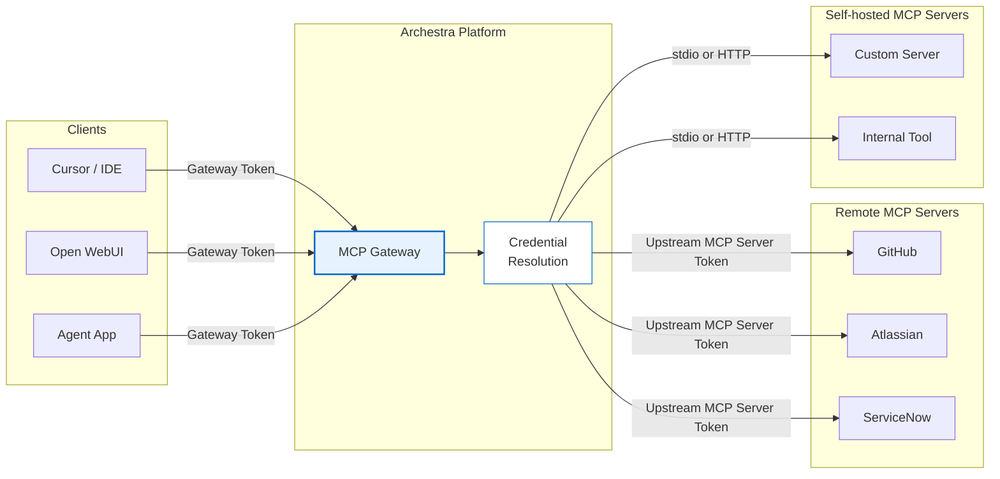

<!--
Check ../docs_writer_prompt.md before changing this file.

This document is human-built, shouldn't be updated with AI. Don't change anything here.

Exception:
- Screenshot
-->

MCP Gateways are the MCP endpoints you expose to clients such as Cursor, Claude Desktop, Open WebUI, and custom agents. Each gateway presents a curated set of tools through one MCP endpoint, so clients do not need to connect to every MCP server directly.

Use separate gateways when different clients, teams, or environments need different tool sets or authentication rules. For example, one gateway might expose developer tools to an engineering team, while another exposes support tools to a customer operations agent.

## Gateway Model

A gateway is a named MCP surface. It has its own visibility, authentication settings, and assigned tools. The same installed MCP server can appear behind multiple gateways, but each gateway decides which clients can reach it and which tools are exposed.

Create or edit gateways from **MCPs > Gateways**. A usable gateway needs:

- at least one assigned tool
- a supported client authentication path
- visibility that matches the users or teams that should call it

Tool assignments can point to a specific installed MCP server connection or use **Resolve at call time**. Resolve-at-call-time is useful when the same gateway should use the caller's own GitHub, Jira, or other upstream credential instead of a shared connection.

After the gateway is configured, use **Connect** to copy connection details for supported clients.

## Tool Assignment

An admin picks each gateway tool explicitly. Each assignment can be pinned to a specific installed MCP server connection, or use **Resolve at call time** (see Gateway Model above).

Use explicit assignment when different clients need different subsets of the same installed MCP server, or when a gateway should use a shared service-account connection for some tools and caller-specific credentials for others.

## Authentication

Gateway authentication and upstream MCP server authentication are separate. The client authenticates to Archestra first. When a tool runs, Archestra resolves the credential needed by that specific upstream MCP server.

MCP Gateways support four client authentication paths:

- **OAuth 2.1**: MCP-native clients authenticate through the [MCP Authorization spec](https://modelcontextprotocol.io/specification/2025-11-25/basic/authorization). Archestra supports Authorization Code + PKCE, DCR, CIMD, and standard well-known discovery.
- **ID-JAG**: Enterprise-managed MCP clients exchange an identity assertion JWT for an Archestra-issued MCP access token scoped to the gateway.
- **Identity Provider JWKS**: Clients send an external IdP JWT directly to the gateway. Archestra validates it against the IdP's JWKS and matches the caller to an Archestra user.
- **Bearer Token**: Direct integrations send `Authorization: Bearer arch_<token>`. Tokens can be scoped to a user, team, or organization.

Use OAuth 2.1 for standard MCP clients, ID-JAG or JWKS for enterprise-managed identity, and bearer tokens for direct service integrations or simple local setup.

See [MCP Authentication](/docs/mcp-authentication) for more details.

## Access Control

Gateway access depends on both the caller and the gateway configuration. A user must be allowed to see the MCP Gateway, usually through organization visibility or team membership, and the gateway must have the specific tool assigned to it.

If a gateway is scoped to one team, members outside that team cannot use it even if the underlying MCP server exists in the registry. This lets admins approve MCP servers centrally while still exposing different tool sets to different teams or clients.

See [Access Control](/docs/platform-access-control) for the permission model.

## Load Tools When Needed

By default, a gateway exposes every assigned tool through MCP `tools/list`.

For larger toolsets, enable **Load tools when needed** in the gateway dialog. This keeps the initial tool list small. Clients see the built-in [`search_tools`](/docs/platform-archestra-mcp-server#search_tools) and [`run_tool`](/docs/platform-archestra-mcp-server#run_tool) tools first.

Those two tools are enabled implicitly and do not appear in the built-in tool picker. The rest of the gateway's assigned tools stay available on demand:

- `search_tools` can discover them
- `run_tool` can execute them

Use this when the full tool list is too large or noisy to send to the model on every turn, but the gateway still needs the same underlying tool access.

With **Access all tools** also enabled, a signed-in user's `search_tools` and `run_tool` reach every MCP catalog tool and knowledge source that user can access. Credentials resolve at call time per the MCP server's **Agent connections** setting — on behalf of the user by default, or one shared account when the server is configured that way. Nothing is assigned to the gateway. Sessions authenticated with org or team tokens stay limited to assigned tools, and the org-wide **Dynamic Tool Access** security setting can disable the behavior entirely.

Tool call policies still apply to the target tool. `run_tool` does not bypass input conditions, team conditions, untrusted-context rules, or approval-required rules.

## Custom Headers

MCP Gateways can forward selected client request headers to downstream HTTP-based MCP servers. Use this for request-specific context such as correlation IDs, tenant IDs, or other application headers that need to reach the server handling the tool call.

Configure the allowlist in the gateway's **Advanced** section. Only headers on the allowlist are forwarded; all others are dropped. Header names are case-insensitive and stored in lowercase.

Gateway header passthrough does not override credentials managed by Archestra. If a forwarded header conflicts with an upstream credential header such as `Authorization`, the credential resolved by Archestra takes precedence.

Header passthrough applies to remote MCP servers and local MCP servers using streamable-http transport. Stdio-based servers do not support HTTP headers.

## Elicitation

MCP servers behind a gateway can use MCP elicitation to ask the connected client for more information during a tool call. Archestra passes these requests through only when the caller supports elicitation, so non-interactive clients are not asked to complete forms.
