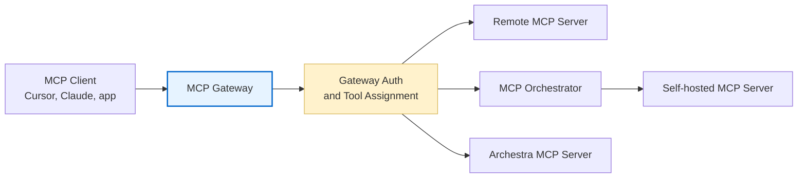

<!--
Check ../docs_writer_prompt.md before changing this file.
-->

MCP is Archestra's tool layer. It lets agents and external MCP clients use tools from remote MCP servers, self-hosted MCP servers, and built-in Archestra tools through one governed control plane.

The main pieces are:

- **[Private MCP Registry](/docs/platform-private-registry)**: the catalog where teams define which MCP servers can be installed, how they are configured, and which credentials they require.
- **[MCP Gateway](/docs/platform-mcp-gateway)**: the client-facing endpoint for Cursor, Claude Desktop, Open WebUI, custom agents, and other MCP clients.
- **[MCP Orchestrator](/docs/platform-orchestrator)**: the runtime for self-hosted MCP servers. It creates isolated Kubernetes deployments, manages server lifecycle, and routes gateway traffic to local servers.
- **[MCP Authentication](/docs/mcp-authentication)**: the gateway and upstream credential model. Clients authenticate to Archestra, then Archestra resolves the credential needed by each upstream MCP server at tool-call time.
- **[Archestra MCP Server](/docs/platform-archestra-mcp-server)**: built-in tools for managing platform resources such as agents, MCP gateways, registry entries, policies, and limits.

## How Tools Are Reached

The gateway is the stable endpoint clients connect to. The registry and orchestrator decide where tools come from. Authentication decides who can call the gateway and which upstream credential should be used when a tool runs.

## Server Runtimes

Remote MCP servers run outside Archestra and are reached over HTTP. Use them when the server is already hosted by a provider or another internal team.

Self-hosted MCP servers run inside your Kubernetes cluster through the MCP Orchestrator. Use them when you want isolation, lifecycle management, local network access, or a custom server image.

Both types can be assigned to Agents and MCP Gateways. The client does not need to know which runtime backs each tool.

Some MCP servers expose resources through `resources/list` instead of callable tools through `tools/list`. When a remote server has resources but no tools, Archestra creates read-resource tools during installation so agents can access those resources through the normal tool assignment flow.

## Environments

A self-hosted MCP server is deployed into an [environment](/docs/platform-environments) — a deployment target that controls the Kubernetes namespace it runs in and the egress network policy applied to its pod. Use environments to isolate a sandbox server from production resources or to limit what a server can reach on the network.

For self-hosted servers the egress policy is enforced continuously on the pod. Remote servers run outside Archestra and are reached over HTTP, so the policy cannot constrain what they reach; instead Archestra checks a remote server's URL host against the environment's policy when it is added or edited and on every outbound connection, blocking a server the policy forbids. See [network egress policies](/docs/platform-environments#network-egress-policies) for the full model.

## Authentication Model

MCP access has two layers:

- **Gateway authentication** controls whether the client can call the MCP Gateway. Supported paths include OAuth 2.1, ID-JAG, external IdP JWT validation through JWKS, and static Archestra bearer tokens.
- **Upstream MCP server authentication** controls how Archestra authenticates to the MCP server or external SaaS API behind the tool. Credentials can be static, OAuth-based, dynamically resolved per caller, exchanged through an enterprise IdP, or forwarded as a JWT for upstream JWKS validation.

## Observability

Archestra records MCP tool usage so teams can monitor which tools are being called, which servers handle them, and whether calls succeed or fail. See [MCP Metrics](/docs/platform-observability#mcp-metrics) for Prometheus metrics and [MCP Tool Call Spans](/docs/platform-observability#mcp-tool-call-spans) for trace details.
