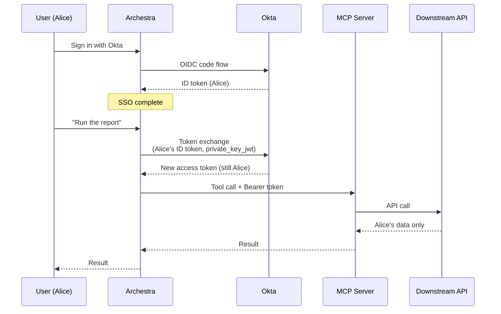

<!--
Check ../docs_writer_prompt.md before changing this file.

Six top-level sections, mirroring the Entra page structure:
1. Register Okta App for SSO
2. Configure SSO in Archestra
3. Roles & Teams Sync
4. Additional Okta App Settings for Token Exchange
5. Configure Token Exchange in Archestra
6. Connect MCP Server

Keep it short. No "Best Practices" or "Future Considerations". Replace the
[screenshot: ...] markers with real screenshots from the running platform per
docs_writer_prompt.md.
-->

This guide configures Okta with Archestra end-to-end. After you finish, your users will sign in once with their Okta account and the agents and MCP servers they use will act on their own behalf — calling downstream APIs as them, not as a shared service account.

<!-- video-placeholder: full-walkthrough screencast. Replace with <video> tag or YouTube/Loom embed once recorded. Suggested filename: /docs/assets/videos/platform-okta-setup_full-walkthrough.mp4 -->

## What is Okta-managed token exchange and why does it matter?

When someone like Alice asks an agent to call a downstream API, Archestra needs to make that call on Alice's behalf. The naive way is to give the MCP server a single shared secret. Every user's request hits the API as the same robot. Audit logs show "the Archestra service account" did the work, not Alice. If Alice doesn't have access to a particular resource, the tool reads it anyway.

Okta solves this through its **AI agent token exchange** flow. When Alice signs in, Archestra holds her ID token. The moment a tool needs to call a downstream API, Archestra hands that token to Okta and asks for a *new* token — same user, scoped to the API the tool actually needs. The downstream call carries Alice's real identity. If she's not allowed, it fails. If she is, the audit trail shows it was her. ([Okta docs](https://developer.okta.com/docs/guides/ai-agent-token-exchange/authserver/main/))

Here is what that looks like end-to-end:



The same Okta application powers both halves of this picture — sign-in and token exchange. You will not be juggling two apps, two secrets, or two sets of permissions.

And now here is the step-by-step guide to configure all of that.

The first three sections get sign-in working. If that is all you need today, you can stop after Section 3 and come back to token exchange later. Sections 4 through 6 layer the token exchange flow on top of the same app you just registered.

## 1. Register Okta App for SSO


### Prerequisites

- An Okta admin account with permission to add app integrations from the OIN
- An Archestra admin account
- Your Archestra hostname **without protocol**, for example `your-archestra-domain.com`

### Recommended: install from the Okta Integration Network (OIN)

Archestra is published as an app integration in the [Okta Integration Network](https://help.okta.com/oie/en-us/Content/Topics/Apps/apps-add-applications.htm). The OIN flow is the recommended path — it pre-configures redirect URIs, scopes, and grant types for you.

1. In the Okta Admin Console, go to **Applications > Applications**
2. Click **Browse App Catalog** and search for **Archestra**
3. Open the Archestra app integration and click **Add**
4. In **General Settings**, enter an application label and your Archestra hostname **without protocol**.

   For example, if your Archestra URL is:

   ```
   https://your-archestra-domain.com
   ```

   enter:

   ```
   your-archestra-domain.com
   ```

5. Complete the Okta app setup
6. Assign the users or groups that should access Archestra
7. On the app's **Sign On** tab, copy the **Client ID** and **Client Secret** — you'll paste them into Archestra
8. Find your Okta org issuer in the upper-right profile menu of the Admin Console, or in the browser URL (it usually looks like `https://your-org.okta.com`)

> Archestra does not support Okta DPoP for SSO clients. In the app's **General > Client Credentials** settings, disable **Require Demonstrating Proof of Possession (DPoP) header in token requests**.

### Alternative: manual app integration

If your tenant does not have access to the OIN tile, create the app manually:

1. In the Okta Admin Console, go to **Applications > Applications** > **Create App Integration**
2. Select **OIDC - OpenID Connect** and **Web Application**
3. Set **Sign-in redirect URIs** to `https://your-archestra-domain.com/api/auth/sso/callback/Okta` (the `Okta` segment is case-sensitive)
4. Set **Sign-out redirect URIs** to `https://your-archestra-domain.com/auth/sign-in`
5. For Okta dashboard launch, set **Login initiated by** to **Either Okta or App**
6. Set **Login flow** to **Redirect to app to initiate login (OIDC Compliant)**
7. Set **Initiate login URI** to `https://your-archestra-domain.com/auth/sso/Okta`
8. Keep **Send ID Token directly to app (Okta Simplified)** disabled
9. Assign the users or groups that should access Archestra
10. Save the integration and copy the Client ID and Client Secret from the **Sign On** tab

## 2. Configure SSO in Archestra


Go to **Settings > Identity Providers** and click **Enable** on the **Okta** card.

Fill in:

- **Issuer:** your Okta org issuer, for example `https://your-org.okta.com`
- **Client ID:** from Okta's **Sign On** tab
- **Client Secret:** from Okta's **Sign On** tab
- **Discovery Endpoint:** leave empty — Archestra derives it from the issuer as `https://your-org.okta.com/.well-known/openid-configuration`

Click **Create Provider**. Users can now sign in:

- **From the Archestra sign-in page** by entering their email address and clicking **Log in**. Archestra matches the email domain to the Okta provider, redirects the user to Okta, then completes the OIDC callback after Okta authentication.
- **From the Archestra tile on their Okta End-User Dashboard** — Okta redirects to `https://your-archestra-domain.com/auth/sso/Okta`, Archestra starts the OIDC flow, then Okta returns the user through the callback URL

Test in a private browser window with a user who is assigned to the Okta app.

### Supported SSO features

| Feature | Supported | Notes |
| --- | --- | --- |
| **IdP-initiated SSO** | Yes | Users can start from the Archestra tile in the Okta End-User Dashboard. For manual integrations, use the OIDC-compliant **Redirect to app to initiate login** flow and set the initiate login URI to `https://your-archestra-domain.com/auth/sso/Okta`. |
| **SP-initiated SSO** | Yes | Users open the Archestra login page, enter their email address, and click **Log in**. Archestra redirects them to Okta, then Okta returns them to Archestra through the OIDC callback URL after authentication. |
| **SP-initiated SLO** | Yes | When users sign out of Archestra, Archestra can redirect them to Okta's OIDC logout endpoint. Keep **Enable RP-Initiated Logout** on unless your Okta app rejects the `post_logout_redirect_uri` parameter. |
| **JIT provisioning** | Yes | First-time SSO users are created during login, then role mapping and team sync are applied from Okta claims. |

At this point SSO is working. If you also want token exchange for downstream MCP tool calls, continue with Section 4.

## 3. Roles & Teams Sync

Role mapping and team sync are provider-agnostic and fully documented on dedicated pages:

- [Role Mapping](/docs/platform-sso-role-mapping)
- [Team Sync](/docs/platform-sso-team-sync)

For Okta, the most common pattern is mapping the `groups` claim to Archestra teams. Make sure the **Groups claim** is enabled in your Okta authorization server or app integration, and that the SSO provider scopes include `groups`. Okta's guide covers both pieces: [Customize tokens returned from Okta with a groups claim](https://developer.okta.com/docs/guides/customize-tokens-groups-claim/main/).

When using the Archestra OIN app, Okta only includes groups whose names start with `Archestra_` in the `groups` claim. For example, map Okta groups like `Archestra_Admin` or `Archestra_Engineering` to the matching Archestra role rules or team links. Okta can include up to 100 groups in the claim.

Then in Archestra, leave the default group extraction or use:

```handlebars
{{#each groups}}{{this}},{{/each}}
```

If your Okta tenant ships roles as a JSON-string claim instead of a native array, parse it with the `json` helper. See the parent page for examples.

## 4. Additional Okta App Settings for Token Exchange


Token exchange uses the same Okta application as SSO, but adds two pieces:

1. A **public/private keypair** so Archestra can authenticate to Okta with a signed JWT (`private_key_jwt`)
2. **Token exchange enabled** on the authorization server, with the right grant types and scopes

Follow Okta's official guide for the up-to-date Admin Console steps: [AI agent token exchange](https://developer.okta.com/docs/guides/ai-agent-token-exchange/authserver/main/). At minimum you'll need to:

- Generate a public/private keypair and register the public key on the Okta app under **Public Keys**
- Note the **Key ID (kid)**
- Enable the **`urn:ietf:params:oauth:grant-type:token-exchange`** grant type on the app
- Configure the authorization server's policies to allow the exchange for your app
- Decide which downstream resource (audience or scope) the exchanged token should be minted for

## 5. Configure Token Exchange in Archestra


Reopen the Okta provider in **Settings > Identity Providers** and expand **Enterprise-Managed Credentials**.

Archestra detects the Okta hostname and pre-selects sensible defaults: **Private key JWT** authentication and **ID token** as the user token to exchange.

Fill in:

- **Exchange Client ID:** leave empty (reuses the Client ID from Section 2) or paste it explicitly
- **Exchange Token Endpoint:** `https://your-org.okta.com/oauth2/v1/token` (or the per-authorization-server endpoint if you use a custom one)
- **Exchange Client Authentication:** _Private key JWT_
- **Signing Key ID:** the `kid` of the public key you registered in Section 4
- **User Token To Exchange:** _ID token_

Save the provider. Archestra will use the matching private key (configured via deployment secret — see [Secrets Management](/docs/platform-secrets-management)) to sign client assertions when exchanging tokens.

## 6. Connect MCP Server


Open the catalog entry for the MCP server that should call your downstream API and scroll to **Multitenant Authorization**. Select **Identity Provider Token Exchange**, pick the Okta provider you just configured, then fill in:

- **Requested Credential:** _Bearer token_
- **Injection Mode:** _Authorization: Bearer_
- **Managed Resource Identifier:** the audience or scope Okta should mint the token for, for example `api://my-downstream-api` or a space-separated list of scopes

Save the catalog item. When you assign tools from this server to an Agent or Gateway, pick **Resolve at call time** as the credential resolution type.

> Local MCP servers must use the **streamable-http** transport — stdio servers don't support per-request token exchange. Gateway auth must carry per-user identity (JWKS, OAuth 2.1, or personal user bearer tokens); team or org bearer tokens won't resolve to a specific user.

## Troubleshooting

- **App tile opens the wrong place** (OIN install). The Archestra hostname in Okta must not include `https://` or a path — only the bare hostname.
- **Manual Okta tile does not start SSO.** Set **Login initiated by** to **Either Okta or App**, **Login flow** to **Redirect to app to initiate login (OIDC Compliant)**, and **Initiate login URI** to `https://your-archestra-domain.com/auth/sso/Okta`. Do not use **Send ID Token directly to app (Okta Simplified)**.
- **User cannot sign in.** Verify the user is assigned to the Archestra app integration in Okta.
- **User denied after successful Okta authentication.** Verify the user matches any configured Archestra role mapping rules.
- **Issuer mismatch on setup.** Verify that **Issuer** and **Discovery Endpoint** point to the same Okta org. Do not leave sample values such as `your-domain.okta.com` in either field.
- **Login fails after redirect** (manual install). The Okta **Sign-in redirect URI** must exactly match the Archestra callback URL, including the case-sensitive `Okta` segment.
- **`invalid_dpop_proof` error.** DPoP is enabled on the Okta application. Disable it in the app's security settings.
- **Sign-out returns an Okta error.** Set the Okta **Sign-out redirect URI** to `https://your-archestra-domain.com/auth/sign-in`, or disable **Enable RP-Initiated Logout** in the Archestra provider settings.

Reference: [Enterprise-Managed Auth](/docs/platform-enterprise-managed-auth), [MCP Authentication — Upstream Identity Provider Token Exchange](/docs/mcp-authentication#upstream-identity-provider-token-exchange).
