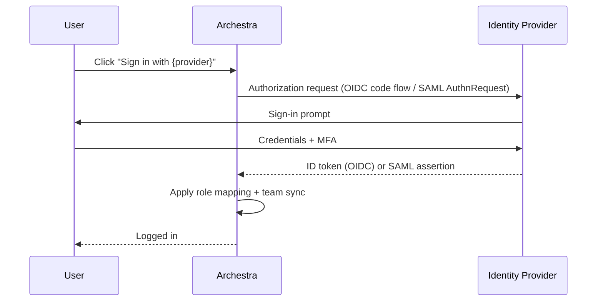

<!--
Check ../docs_writer_prompt.md before changing this file.

Provider-agnostic SSO concept page. Covers what SSO is in Archestra, how the
flow works, callback URL formats, supported protocols, allowed-domain
boundary, basic-auth/invitation toggles, user provisioning, account linking,
and common SSO error codes.

Per-provider walkthroughs (Entra, Okta) live on their own pages and link here.
-->

Single Sign-On (SSO) lets users sign in to Archestra with the identity they already have at work — Microsoft, Okta, Google, GitHub, GitLab, or any OIDC/SAML provider — instead of managing yet another username and password.

## How sign-in works

1. Admin configures an Identity Provider in **Settings > Identity Providers**
2. SSO buttons appear on the Archestra sign-in page for every enabled provider
3. The user clicks the button and authenticates with their identity provider
4. Archestra applies role mapping and team sync rules
5. The user is provisioned (if new) and logged in




## Supported protocols

Archestra speaks two SSO protocols:

| Protocol | Use it for |
| --- | --- |
| **OIDC** (OpenID Connect) | Microsoft Entra ID, Okta, Google, GitHub, GitLab, Auth0, Keycloak, any modern OAuth 2.0 + OIDC provider |
| **SAML 2.0** | Older enterprise IdPs that don't speak OIDC, or organizations standardized on SAML |

OIDC is the default choice for new setups. SAML is supported for compliance-driven environments.

## Callback URLs

Each protocol uses a different callback URL format. Both contain a `{ProviderId}` segment that is **case-sensitive** and must match the provider ID configured in Archestra exactly (for example `Okta`, `EntraID`, `Google`).

### OIDC

```
https://your-archestra-domain.com/api/auth/sso/callback/{ProviderId}
```

For local development:

```
http://localhost:3000/api/auth/sso/callback/{ProviderId}
```

### SAML (Assertion Consumer Service URL)

```
https://your-archestra-domain.com/api/auth/sso/saml2/sp/acs/{ProviderId}
```

For local development:

```
http://localhost:3000/api/auth/sso/saml2/sp/acs/{ProviderId}
```

## Allowed Email Domains

The **Allowed Email Domains** field is an optional Archestra-side sign-in boundary. When configured, users can sign in with that provider only when the email returned by the IdP matches one of the configured domains.

Use comma-separated domains for multi-domain SSO:

```
company.com, subsidiary.com
```

Subdomains are included automatically — `engineering.company.com` matches `company.com`.

## User provisioning

When a user authenticates via SSO for the first time:

1. A new user account is created with the email and name from the identity provider
2. The user's role is determined by role mapping rules (if configured), otherwise the provider's default role (or **Member**)
3. The user is added to the organization
4. A session is created and the user is logged in

Subsequent logins link to the existing account by email. Role mapping rules are evaluated on each login, so role changes in the IdP take effect on next sign-in.

## Account linking

If a user already has an Archestra account (for example created via email/password), SSO will automatically link to it when:

- The email addresses match
- The SSO provider is trusted for account linking — Archestra trusts the built-in providers (Okta, Google, GitHub, GitLab, Entra ID) plus any custom Generic OIDC or Generic SAML provider configured in Identity Providers

## Downstream providers

An identity provider can be configured without being used for login. Disable **Use for Single Sign-On** when the provider is only used to link delegated tokens for downstream MCP tool calls. With this disabled, the provider is hidden from the sign-in page and its role mapping and team sync never run — connecting the provider to fetch a downstream token cannot change a user's Archestra role or team memberships.

This is useful when one provider is the primary Archestra login provider, but a specific MCP tool needs a token from another provider. See [Enterprise-Managed Auth — Linked downstream IdPs](/docs/platform-enterprise-managed-auth#linked-downstream-idps).

## Disabling Basic Authentication

Once SSO is working, you can disable the username/password login form to enforce SSO-only authentication. Set `ARCHESTRA_AUTH_DISABLE_BASIC_AUTH=true` and restart the backend. See [Deployment — Environment Variables](/docs/platform-deployment#environment-variables).

> **Important:** verify at least one SSO provider is working before disabling basic auth, or you (and your admins) will be locked out.

## Disabling User Invitations

For organizations using SSO with auto-provisioning, you can disable the manual invitation system entirely. This hides the invitation UI and blocks invitation API endpoints. Set `ARCHESTRA_AUTH_DISABLE_INVITATIONS=true`. See [Deployment — Environment Variables](/docs/platform-deployment#environment-variables).

## Per-provider walkthroughs

Each provider has its own end-to-end setup page:

- [Microsoft Entra ID SSO + OBO](/docs/platform-entra-obo-setup)
- [Okta SSO + Token Exchange](/docs/platform-okta-setup)

For Google, GitHub, GitLab, Generic OIDC, and Generic SAML, see the per-provider sections on the [Identity Providers index](/docs/platform-identity-providers#supported-providers).

## Troubleshooting

### `state_mismatch` error

Cookies are being blocked, or the callback URL doesn't match.

- Third-party cookies must be enabled in the browser
- The callback URL configured at the IdP must exactly match the Archestra callback URL, including the case-sensitive `{ProviderId}` segment

### `missing_user_info` error

The IdP didn't return the required user attributes. For GitHub, the user must have a **public** email set in their GitHub profile.

### `account not linked` error

The SSO provider is not trusted for automatic account linking, or the provider returned an email that doesn't match the existing account. Verify the provider is configured in Identity Providers and the user is signing in with the same email as their existing account.

### `invalid_dpop_proof` error (Okta)

DPoP is enabled on the Okta application. Disable **Require Demonstrating Proof of Possession (DPoP) header in token requests** in the Okta app's security settings.

### `account_not_found` error (SAML)

The SAML assertion didn't contain the required user attributes. Configure your IdP to send:

- `NameID` in `emailAddress` format
- `email` attribute
- `firstName` and `lastName` attributes (recommended)

### `signature_validation_failed` error (SAML)

The SAML response signature couldn't be verified.

- The IdP certificate in Archestra must match the current signing certificate from your IdP
- If using IdP metadata, re-download it (certificates rotate)

## See also

- [Enterprise-Managed Auth](/docs/platform-enterprise-managed-auth) — SSO's counterpart for downstream MCP tool calls (OBO, ID-JAG, RFC 8693)
- [Role Mapping](/docs/platform-sso-role-mapping) — map IdP claims to Archestra roles
- [Team Sync](/docs/platform-sso-team-sync) — sync IdP groups to Archestra teams
